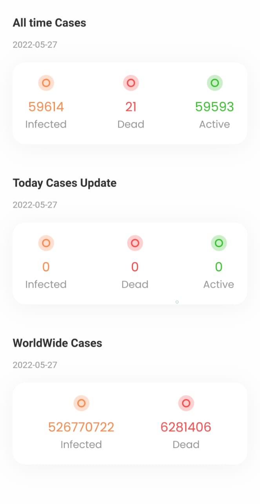

# Covid 19

A flutter application to track the covid 19 cases in the world.
It includes all the countries and their data.

# Preview




# How it works
It uses ```https://api.covid19api.com``` to fetch the data, and displays it in an elgant way.

# How to use it
Download the apk for android and run it.

(Note: IOS is not yet supported)


# LICENSE and CONTRIBUTORS
MIT License, open source. Open for contribution. 

